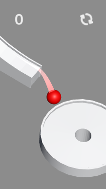
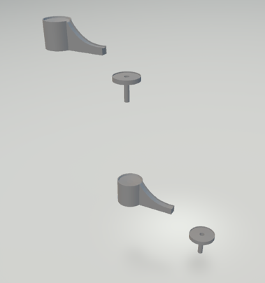

# Тестовое задание в DorferGames на должность Junior Unity3D Developer

## Результат

 
*рис.1 готовое задание*

## Вводная

Если в концепте не прописано как именно что-либо реализовать, то нужно самому принять решение, как реализовать лучше, исходя из баланса между данным временем разработки и качеством результата. 
Задание рассчитано на 4-8 часов. (Ждем от вас результат в течение пары ближайших дней)

## Задачи

1. Скачать и поиграть в игру **Tenkyu** от Voodoo. Это одна из известных игр в жанре hypercasual. Схожими простыми аркадами, основанными на интересной физике, вам и предстоит заниматься у нас.
https://play.google.com/store/apps/details?id=io.voodoo.tenkyu&hl=ru 
https://apps.apple.com/ru/app/tenkyu/id1189800250

2. Сделать простенькую копию этой игры с 1 игровым уровнем.

3D-модель уровня: https://drive.google.com/file/d/1HzGZ7kKMH62Oze8-CSigQsol6u1z5C2u/view?usp=sharing  
Прохождение уровня в оригинале: https://youtu.be/XMMd_0wj3AY?t=233 (с 3:53 сек до 3:57 сек)

Необходимо реализовать **аналогичное управление, игровую физику и поведение камеры.**

После падения мячика в дырку **он должен падать** на расположенный ниже идентичный уровень на стартовую точку (рис.1) и так далее. В этом аспекте надо **максимально повторить оригинал**, только там уровни разные, а у нас будет одинаковый. Уровни пусть сменяют друг друга **до бесконечности**.

 
*рис.2 иллюстрация смены уровней*

Вверху справа сделать кнопку “restart”, которая перезагружает сцену.

3.  Убедиться, что версия рабочая и **хорошо работает на телефоне**. Выслать результат в формате **.apk**. Указать сколько времени заняло выполнение.

При оценке выполнения будут оцениваться:
* выполнение указанных задач
* качество реализации указанных задач **для игрока** (то есть отсутствие критичных багов, тормозов, дерганого или рваного движения объектов, лагов физики, несрабатывания коллайдеров и проч). Это требует минимального понимания геймдизайна

## F.A.Q.

1.	Не надо стремиться к красоте кода, оценивать будем только .apk. Важно как это будет работать для игрока
2.	Графика не важна. Ее надо сделать на примитивах Unity, вроде кубов, сфер, капсул и т.п. 
3.	Эффекты (в том числе трейлы, туман, всплывающие надписи, разные бонусы и т.п.) делать не нужно. 
4.	Какой-либо игровой интерфейс тоже делать не нужно.
5.	При наклоне игрового уровня мяч не должен странно подпрыгивать или куда-то проваливаться
